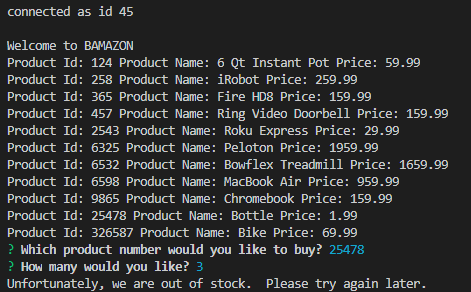
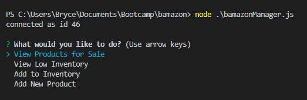
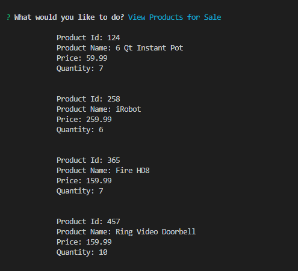
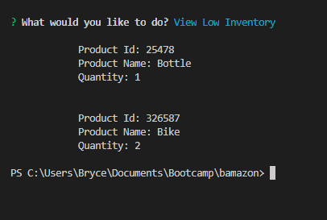
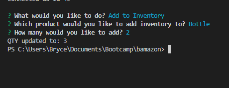
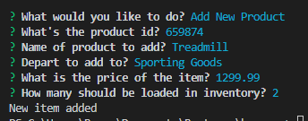

# Bamazon Application

##Introduction to mySQL
This application represents our first experience using mySQL.  Our challenge was to create a simple CLI version of an Amazon type setting allowing users to order products and update our database dynamically using Javascript.

##SQL Database Setup

##Introduction to Customer Application
The application will provide a list of product ids, names, and pricing for the shopper to select.  As part of the assignment, we were required to have the user select by ID number.

Once the customer selects their item, they are prompted to enter a quantity they would like to order.

If Bamazon has sufficient inventory, the user is provided with a successful message and their order price is displayed.

If there is insufficient inventory the customer is notified.

##Introduction to Manager Application

The manager application allows a manager to select one of four options shown below.

If the manager selects "View Products for Sale", they are returned all of the items in the database for sale.

If the manager selects "View Low Inventory", they are returned all of the items in the database with less than 5 units on hand.

If the manager selects "Add to Inventory", they are displayed all of the items in the database for selection.  Once a selection is made they are prompted how many they would like to add to inventory.

If the manager selects "Add New Product", they are prompted to enter the product id, product name, department, price, and initial inventory quantity.
