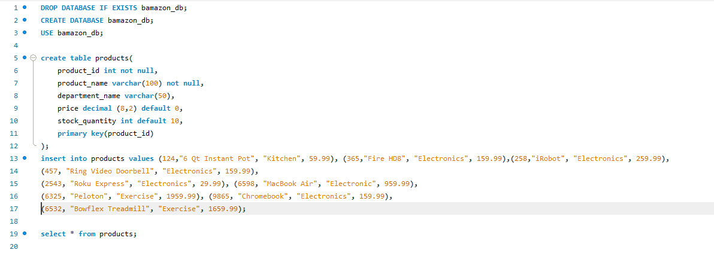
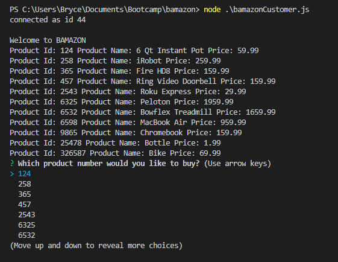
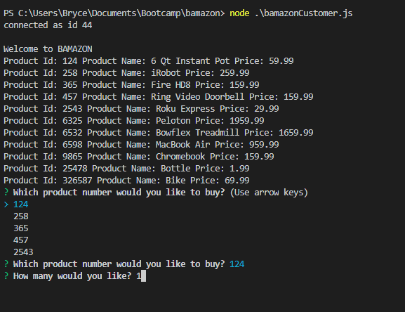

# Bamazon Application

##Introduction to mySQL
This application represents our first experience using mySQL.  Our challenge was to create a simple CLI version of an Amazon type setting allowing users to order products and update our database dynamically using Javascript.

##SQL Database Setup

##Introduction to Customer Application
The application will provide a list of product ids, names, and pricing for the shopper to select.  As part of the assignment, we were required to have the user select by ID number.

Once the customer selects their item, they are prompted to enter a quantity they would like to order.

If Bamazon has sufficient inventory, the user is provided with a successful message and their order price is displayed.

If there is insufficient inventory the customer is notified.

